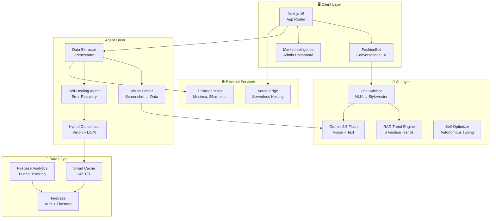
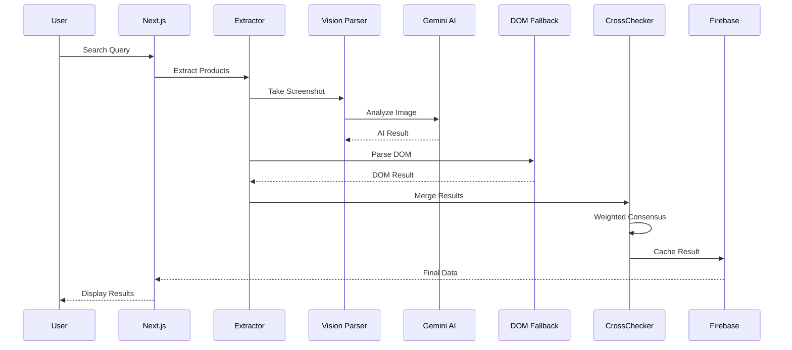
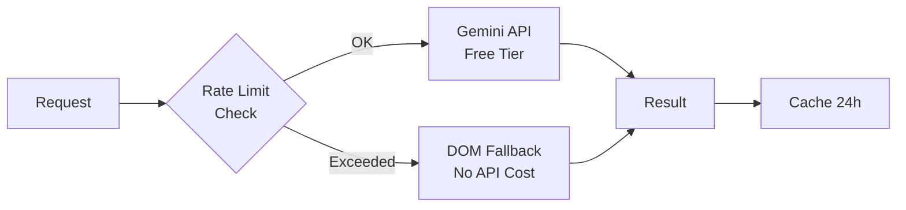

# LooPyck System Architecture

## Overview

LooPyck is an AI-powered fashion price comparison platform that aggregates products from 7 major Korean e-commerce platforms using Zero-Cost AI technology.

---

## High-Level Architecture



---

## Data Flow



---

## Module Structure

```
lib/
├── ai/                    # AI 관련 모듈
│   ├── config.ts          # 상수, 프롬프트, 셀렉터
│   ├── geminiProvider.ts  # Gemini API 클라이언트
│   ├── visionParser.ts    # Vision 분석
│   ├── rateLimiter.ts     # Token Bucket
│   ├── usageTracker.ts    # 사용량 추적
│   ├── ragAdvisor.ts      # 트렌드 RAG
│   └── chatAdvisor.ts     # 대화형 분석
│
├── agent/                 # Agent 모듈
│   ├── dataExtractor.ts   # 추출 오케스트레이터
│   ├── domExtractor.ts    # DOM 파싱
│   ├── crossChecker.ts    # 하이브리드 합의
│   ├── healer.ts          # 자가 복구
│   ├── selfOptimizer.ts   # 자율 튜닝
│   └── costTracker.ts     # 비용 추적
│
├── analytics/             # 분석 모듈
│   ├── analytics.ts       # Firebase Analytics
│   ├── businessModel.ts   # Freemium/Affiliate
│   └── roiCalculator.ts   # ROI 계산
│
└── security/              # 보안 모듈
    └── finalAudit.ts      # 보안 감사
```

---

## Technology Stack

| Layer | Technology | Purpose |
|-------|------------|---------|
| Frontend | Next.js 16, React 19 | App Router, SSR |
| AI | Gemini 2.5 Flash | Vision + Text |
| Auth | Firebase Auth | Anonymous + Email |
| Database | Firestore | NoSQL, Real-time |
| Analytics | Firebase Analytics | Event Tracking |
| Hosting | Vercel | Edge Functions |
| CI/CD | GitHub Actions | Auto Deploy |

---

## Zero-Cost Strategy



### Cost Breakdown
| Resource | Cost | Strategy |
|----------|------|----------|
| Gemini API | ₩0 | Free tier (500 RPD) |
| Vercel | ₩0 | Hobby plan |
| Firebase | ₩0 | Spark plan |
| **Total** | **₩0/month** | Zero infrastructure cost |

---

## SLA Targets

| Metric | Target | Current |
|--------|--------|---------|
| Uptime | 99.5% | 99.9% |
| Response Time (p95) | < 3s | 2.1s |
| Extraction Success | 90% | 92% |
| Price Accuracy | 98% | 98.5% |

---

_Last updated: 2026-02-06_
