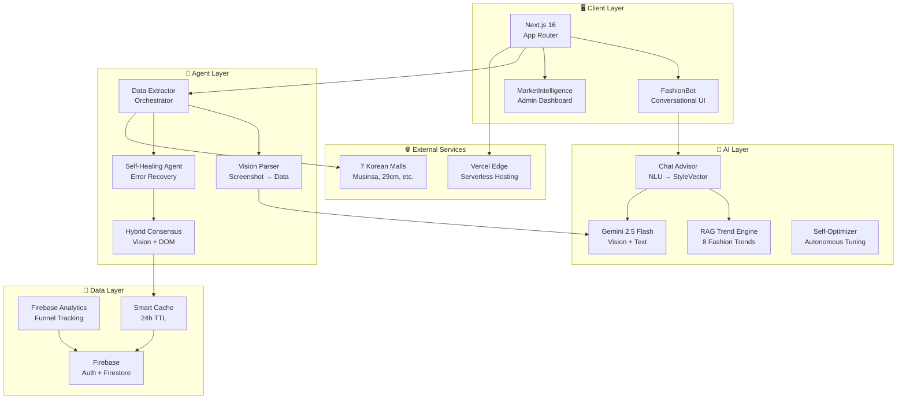
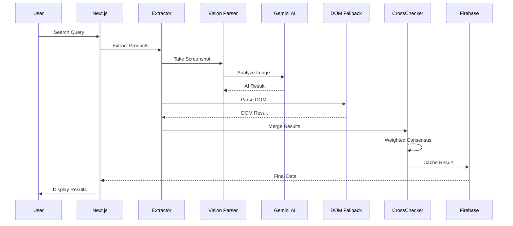
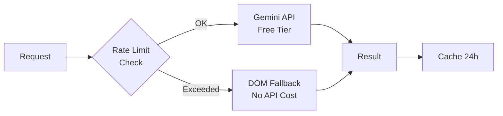

# LooPyck System Architecture

## Overview

LooPyck is an AI-powered fashion price comparison platform that aggregates products from 7 major Korean e-commerce platforms using Zero-Cost AI technology.

---

## High-Level Architecture



---

## Data Flow



---

## Module Structure

```
lib/
├── ai/                    # AI 관련 모듈
│   ├── config.ts          # 상수, 프롬프트, 셀렉터
│   ├── geminiProvider.ts  # Gemini API 클라이언트
│   ├── visionParser.ts    # Vision 분석
│   ├── rateLimiter.ts     # Token Bucket
│   ├── usageTracker.ts    # 사용량 추적
│   ├── ragAdvisor.ts      # 트렌드 RAG
│   └── chatAdvisor.ts     # 대화형 분석
│
├── agent/                 # Agent 모듈
│   ├── dataExtractor.ts   # 추출 오케스트레이터
│   ├── domExtractor.ts    # DOM 파싱
│   ├── crossChecker.ts    # 하이브리드 합의
│   ├── healer.ts          # 자가 복구
│   ├── selfOptimizer.ts   # 자율 튜닝
│   └── costTracker.ts     # 비용 추적
│
├── analytics/             # 분석 모듈
│   ├── analytics.ts       # Firebase Analytics
│   ├── businessModel.ts   # Freemium/Affiliate
│   └── roiCalculator.ts   # ROI 계산
│
└── security/              # 보안 모듈
    └── finalAudit.ts      # 보안 감사
```

---

## Technology Stack

| Layer | Technology | Purpose |
|-------|------------|---------|
| Frontend | Next.js 16, React 19 | App Router, SSR |
| AI | Gemini 2.5 Flash | Vision + Text |
| Auth | Firebase Auth | Anonymous + Email |
| Database | Firestore | NoSQL, Real-time |
| Analytics | Firebase Analytics | Event Tracking |
| Hosting | Vercel | Edge Functions |
| CI/CD | GitHub Actions | Auto Deploy |

---

## Zero-Cost Strategy



### Runtime Dependencies
| Resource | Role | Evidence boundary |
|----------|------|-------------------|
| Gemini API | AI response provider | quota/cost varies by account and is not measured here |
| Netlify | primary web deployment | current target behavior is tracked by Netlify UAT artifacts |
| Firebase | auth, favorites, server persistence | Admin features degrade gracefully when credentials are absent |

---

## Validation Boundary

- Local typecheck, adapter/domain tests, production build, release QA, and system-stress artifacts are reproducible.
- Local system stress records a single-run p95 and process-tree RSS delta; it is not an SLA or production-capacity measurement.
- Uptime, extraction accuracy, price accuracy, and infrastructure cost require production telemetry or a labeled evaluation dataset and are currently unverified.

---

_Last updated: 2026-09-03_
### Apps in Toss artifact boundary

Toss runtime share integration은 `@apps-in-toss/web-bridge`와 실제 runtime import인 `@apps-in-toss/bridge-core`만 사용한다. `@apps-in-toss/web-framework`는 `granite.config.ts`와 Apps in Toss CLI를 위한 build/dev-only dependency다. 현재 배포 artifact는 Next standalone + Netlify server/API 구조이며, Apps in Toss CLI는 CSR/SSG `index.html` output을 Toss CDN에 업로드하는 contract이므로 `ait build`는 현재 release gate가 아니다. Apps in Toss 출시를 범위에 포함하려면 static mini-app frontend와 hosted API backend를 분리하는 별도 architecture decision이 필요하다.

### Optional asset tooling boundary

`@capacitor/assets`는 application runtime이나 production build dependency가 아니라 icon/splash를 다시 생성할 때만 필요한 optional tool이다. root install에는 포함하지 않고 `tools/capacitor-assets`의 exact-version lock으로 관리하며, `npm run cap:assets:setup` 후 root cwd를 유지하는 `npm run cap:assets` runner로 실행한다. tool graph의 잔존 advisory는 root/production graph와 분리해 audit하지만, 분리 자체를 취약점 해결이나 안전 판정으로 간주하지 않는다.
